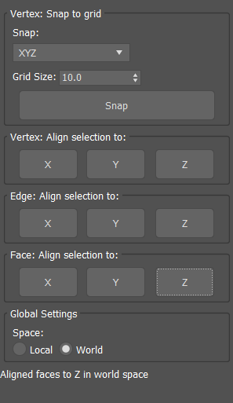

# Max Scripts by Asutekku at Nimikko

A handy collection of maxscripts that's to be updated the more i create them.

A collection of productivity and workflow enhancement scripts for Autodesk 3ds Max. Each tool is designed to solve specific problems faced by 3D artists and technical directors in their daily workflow.

## Available Tools

- [Align Tools](#align-tools) - Precision alignment utility for vertices, edges, and faces
- [Collapse Dead Structs](#collapse-dead-structs) - Utility for cleaning up mesh topology by collapsing dead structures

## Installation

1. **Download the scripts** from this repository
2. **Place the script files** in your 3ds Max scripts directory:
   - `C:\Users\[YourUsername]\AppData\Local\Autodesk\3ds Max [Version]\ENU\scripts\`
3. **Start 3ds Max** and run the scripts from the MAXScript menu or add them to your custom toolbar

## Tools

### Align Tools

A comprehensive alignment utility that provides precise control over the alignment of mesh components in 3ds Max.

#### Features

- **Vertex Alignment** - Align selected vertices to X, Y, or Z axes
- **Edge Alignment** - Align selected edges to X, Y, or Z axes while preserving connected geometry
- **Face Alignment** - Align selected faces to X, Y, or Z axes while preserving connected geometry
- **Grid Snapping** - Snap vertices to a customizable grid with control over which axes to affect
- **Space Selection** - Toggle between local object space and world space operations
- **Connected Component Support** - Intelligently handles connected edges and faces as groups

#### Usage

1. Select an Editable Poly or add an Edit Poly modifier to your object
2. Enter the appropriate sub-object mode (Vertex, Edge, or Face)
3. Select the components you want to align
4. Open the Align Tools dialog from the Nimikko category in the MAXScript menu
5. Choose the appropriate alignment option:

##### Vertex Alignment
- Click the X, Y, or Z button in the "Vertex: Align selection to:" group to align vertices to that axis

##### Vertex Grid Snapping
- Set your desired grid size using the "Grid Size" spinner
- Select which axes to affect from the "Snap" dropdown (X, Y, Z, XY, XZ, YZ, or XYZ)
- Click the "Snap" button to snap selected vertices to the grid

##### Edge Alignment
- Click the X, Y, or Z button in the "Edge: Align selection to:" group to align edges to that axis
- Connected edges will be handled as a group to maintain topology

##### Face Alignment
- Click the X, Y, or Z button in the "Face: Align selection to:" group to align faces to that axis
- Connected faces will be handled as a group to maintain topology

##### Space Toggle
- Use the "Space" radio buttons to switch between Local and World space for all operations

#### Examples

**Vertex Alignment**: Useful for creating flat surfaces, aligning vertices to a specific plane, or cleaning up imported geometry.

**Edge Alignment**: Perfect for creating straight edge flows, fixing non-orthogonal edges, or preparing geometry for boolean operations.

**Face Alignment**: Ideal for flattening sections of a model, creating precise architectural elements, or preparing surfaces for UV mapping.

**Grid Snapping**: Essential for precision modeling, creating evenly spaced elements, or conforming models to scene grid.

### Collapse Dead Structs

A utility for cleaning up mesh topology by removing dead or invalid structures in editable poly objects.

#### Features

- **Single Object Processing** - Collapse dead structures in the currently selected object
- **Multiple Object Support** - Process multiple selected objects at once
- **Batch Processing** - Option to process all editable poly objects in the scene
- **Auto-Update Mode** - Automatically process objects when selection changes
- **Status Feedback** - Visual feedback on processing success and errors

#### Usage

1. Select one or more editable poly objects
2. Open the Collapse Dead Structs dialog from the Nimikko category in the MAXScript menu
3. Choose the appropriate option:

##### Single/Multiple Selection Processing
- Click the "Collapse Selected" button to process the currently selected object(s)

##### Batch Processing
- Click the "Collapse All Editable Polys" button to process all editable poly objects in the scene

##### Auto-Update Mode
- Toggle the "Auto-Update" button to enable automatic processing when selection changes

#### Examples

**Post-Import Cleanup**: Useful for cleaning up models after importing from other software that may contain dead structures.

**Post-Boolean Cleanup**: Essential for fixing mesh topology issues after boolean operations that often create dead structures.

**General Maintenance**: Regular use helps maintain clean topology in complex models during the modeling process.

## Compatibility

- Tested with 3ds Max 2024 & 2025
- Align Tools: Compatible with Editable Poly objects. Does not work with edit poly modifier.
- Collapse Dead Structs: Works with any Editable Poly object.

## Contributing

Contributions, bug reports, and feature requests are welcome! Feel free to submit issues or pull requests.

## License

Feel free to use this as you see.
